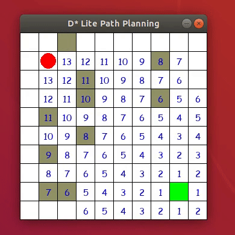

<!-- PROJECT SHIELDS -->
<!--
*** I'm using markdown "reference style" links for readability.
*** Reference links are enclosed in brackets [ ] instead of parentheses ( ).
*** See the bottom of this document for the declaration of the reference variables
*** for contributors-url, forks-url, etc. This is an optional, concise syntax you may use.
*** https://www.markdownguide.org/basic-syntax/#reference-style-links
-->
[![Contributors][contributors-shield]][contributors-url]
[![Stargazers][stars-shield]][stars-url]
[![Issues][issues-shield]][issues-url]

<!-- PROJECT LOGO -->
 

<h3 align="center">D * Lite algorithm with GUI</h3>

  

    Advanced path finding algorithm
     
     
    <a href="https://docs.google.com/document/d/e/2PACX-1vQnl_IcjbdYZ-aUlzHfJQR7w4WXKI8e8FXBRkV2JTDOp6I1mQLMe_ISi1_Bb0B0j8ShaLUqLzaQn3fl/pub">Document Report</a>
    ·
    <a href="https://github.com/CSE4081-d-star-team/d-star-algorithm">View Demo</a>
    ·
    <a href="https://github.com/CSE4081-d-star-team/d-star-algorithm/issues">Report Bug</a>
    ·
    <a href="https://github.com/CSE4081-d-star-team/d-star-algorithm/issues">Request Feature</a>
  

 
 

  

<!-- ABOUT THE PROJECT -->
## About The Project

Simulation for dynamic and heuristic shortest path finder.

There are currently 5 features implemented.

1. Takes different size of the map with obstacles and walls.
  - 'X' as obstacle, 'R' as start, 'G' as goal, 'W' as wall, ' ' as empty cell that can be traverse.
2. A traversing object can go to the next step by pressing space bar.
3. A user can set up own obstacles by clicking left mouse button on the empty cell.
4. If the walls are not fixed(changes to a strong color), user can remove the obstacle by clicking the left mouse button.
5. The critical values(rhs) for the weight value are shown on each of the cell.

(<a href="#top">back to top</a>)

 

### Built With

* [Python 3.8+](https://www.python.org/)

 

<!-- GETTING STARTED -->
## How to run?

In oder to execute the program, please download the file by cloning this repository.

<!-- LICENSE -->
## License

Distributed under the MIT License. See `LICENSE.txt` for more information.

<!-- CONTACT -->
## Contact

Marco Backman - roni2006@hanmail.net

Project Link: [https://github.com/CSE4081-d-star-team/d-star-algorithm](https://github.com/CSE4081-d-star-team/d-star-algorithm)

(<a href="#top">back to top</a>)

<!-- MARKDOWN LINKS & IMAGES -->
<!-- https://www.markdownguide.org/basic-syntax/#reference-style-links -->
[contributors-shield]: https://img.shields.io/github/contributors/CSE4081-d-star-team/d-star-algorithm.svg?style=for-the-badge
[contributors-url]: https://github.com/CSE4081-d-star-team/d-star-algorithm/graphs/contributors
[stars-shield]: https://img.shields.io/github/stars/CSE4081-d-star-team/d-star-algorithm.svg?style=for-the-badge
[stars-url]: https://github.com/CSE4081-d-star-team/d-star-algorithm/stargazers
[issues-shield]: https://img.shields.io/github/issues/CSE4081-d-star-team/d-star-algorithm.svg?style=for-the-badge
[issues-url]: https://github.com/CSE4081-d-star-team/d-star-algorithm/issues
